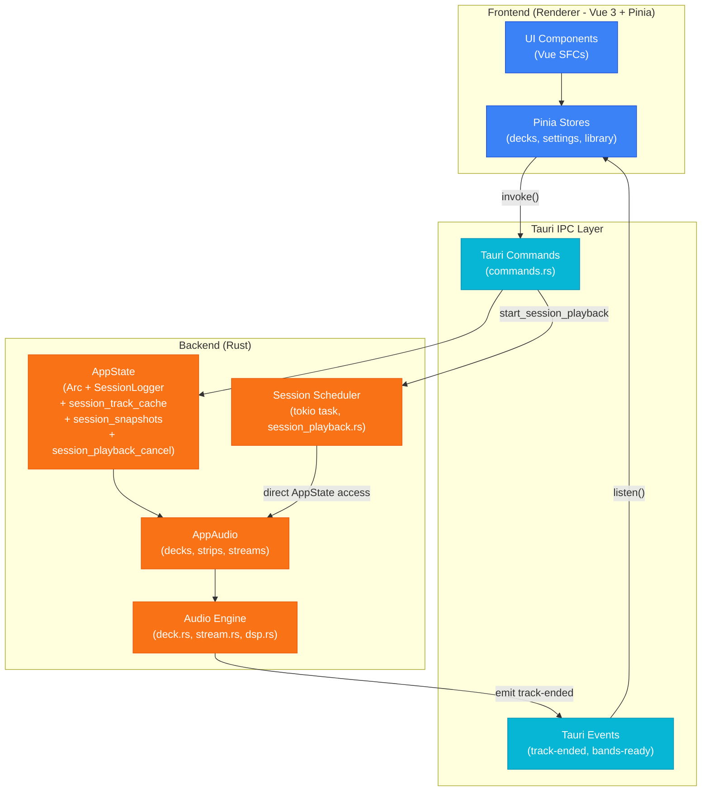
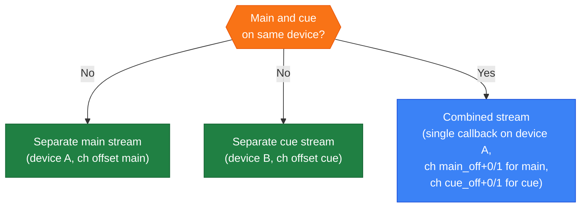
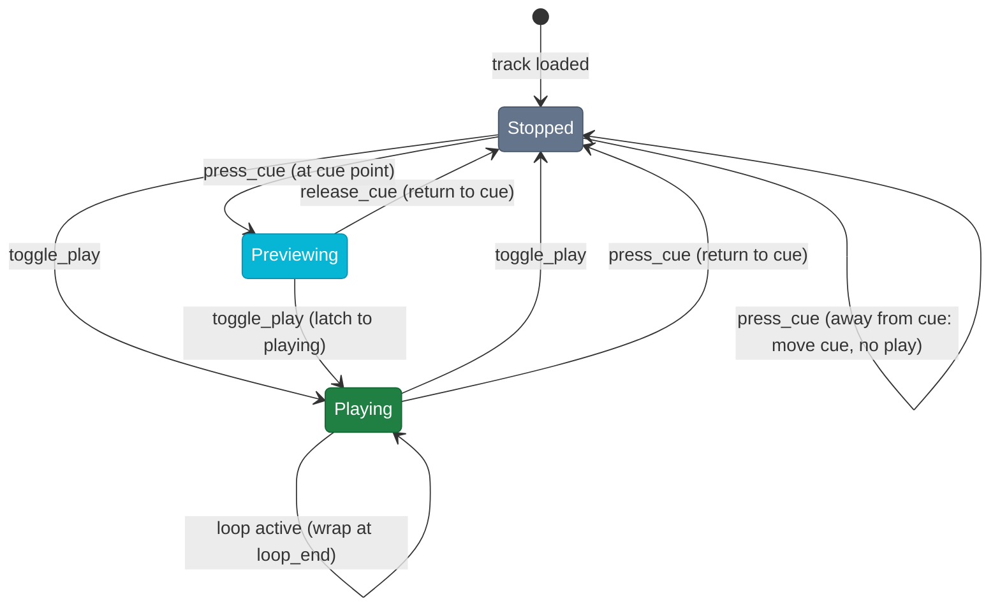
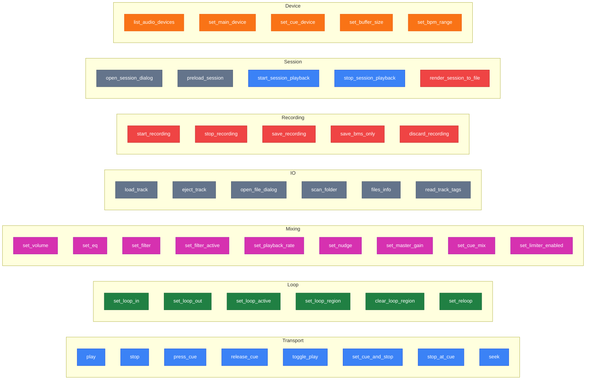
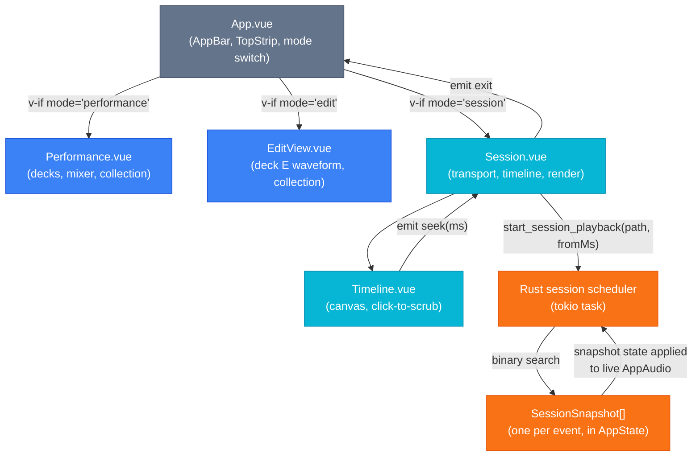

# Architecture

## Overall structure



## Audio signal chain (per deck)

```mermaid
graph LR
    classDef io fill:#64748b,stroke:#475569,color:#fff
    classDef deck fill:#3b82f6,stroke:#1d4ed8,color:#fff
    classDef strip fill:#208043,stroke:#166534,color:#fff
    classDef master fill:#d631b0,stroke:#a21caf,color:#fff
    classDef out fill:#f97316,stroke:#ea580c,color:#fff

    File["Audio File\n(.mp3, .flac, .wav)"]:::io
    Decode["Decode + Resample\n(io.rs)"]:::io
    DeckState["DeckState\n(playback position,\ncue/loop logic,\nspectral bands)"]:::deck
    ChannelStrip["ChannelStrip\n(EQ, filter, gain,\nsmoothed volume fader)"]:::strip
    MasterMix["Master Mix\n(limiter, gain,\nmetering)"]:::master
    Outputs["Output Devices\n(main + cue)"]:::out

    File --> Decode
    Decode --> DeckState
    DeckState -- "main_tick()\ncue_tick()" --> ChannelStrip
    ChannelStrip -- "process_main()\nprocess_cue()" --> MasterMix
    MasterMix --> Outputs
```



## Stream routing



## CUE state machine



## Tauri command categories



## App modes and transitions

The app has three full-page modes managed by `useAppModeStore`. `App.vue` renders the active view via `v-if` on `appMode.mode`. Transitions are handled centrally in `switchTo()`:

- **Performance ↔ Edit**: non-destructive. Entering Edit stops any playing deck; decks stay loaded.
- **Any → Session**: ejects all decks before switching.
- **Session → Any**: calls `session.exit()` (stops playback, clears the loaded file) then resets the mixer.

The AppBar dropdown triggers `switchTo()` with a confirmation dialog when the transition would be destructive (active playback, loaded tracks, or an open session file).



## Session playback: scrubbing and snapshot state machine

On session open, `preload_session` decodes all referenced audio files into a persistent cache and builds a `SessionSnapshot` after every event in the session log. Each snapshot captures the complete state of all decks (position, rate, nudge, loop) and all channel strips (gain, EQ, filter).

When `start_session_playback(fromMs)` is called the scheduler:

1. Finds the last snapshot with `elapsed_ms ≤ fromMs` (binary search)
2. Resets all decks and strips
3. Applies the snapshot's strip/master state to the live engine
4. Replays the few events between the snapshot and `fromMs` through the analytical position simulation
5. Sets final deck positions and starts the tokio timer loop for events after `fromMs`

Position simulation rule: any event that changes playback speed or position (`play`, `stop`, `seek`, `set_playback_rate`, `set_nudge`) commits the current analytically-computed position before updating the relevant parameter. This ensures each segment between events is computed with the correct rate and nudge factor.

## .bms file format

A `.bms` file is a JSON document (UTF-8, pretty-printed) saved alongside or instead of a recording. The extension stands for Beatmatcher Session.

```json
{
  "version": 1,
  "startedAt": "2026-06-06T14:00:00Z",
  "events": [
    { "elapsed_ms": 0,      "type": "recording_start", "buffer_size_frames": 512 },
    { "elapsed_ms": 0,      "type": "deck_snapshot", "deck": "A", "path": "/...", "position_sec": 12.3, "cue_point_sec": 0, "is_playing": false, "bpm": 128.0, "playback_rate": 1.0, "loop_active": false, "loop_end_sec": 0 },
    { "elapsed_ms": 1234.5, "type": "play",     "deck": "A" },
    { "elapsed_ms": 5678.0, "type": "load_track","deck": "B", "path": "/..." },
    ...
    { "elapsed_ms": 3600000, "type": "recording_stop" }
  ]
}
```

`elapsed_ms` is milliseconds since the recording started, rounded to 0.1 ms. `startedAt` is an ISO-8601 wall-clock timestamp.

### Event types

| type                                       | relevant fields                                                                                                      | meaning                                                           |
| ------------------------------------------ | -------------------------------------------------------------------------------------------------------------------- | ----------------------------------------------------------------- |
| `recording_start`                          | `buffer_size_frames`                                                                                                 | first event; records audio callback size for latency compensation |
| `deck_snapshot`                            | `deck`, `path`, `position_sec`, `cue_point_sec`, `is_playing`, `bpm`, `playback_rate`, `loop_active`, `loop_end_sec` | full deck state at record-start for tracks already loaded         |
| `recording_stop`                           |                                                                                                                      | last event                                                        |
| `load_track`                               | `deck`, `path`, `duration`                                                                                           | track loaded onto deck                                            |
| `play`                                     | `deck`                                                                                                               | deck started playing                                              |
| `stop`                                     | `deck`                                                                                                               | deck stopped                                                      |
| `seek`                                     | `deck`, `sec`                                                                                                        | playhead jumped                                                   |
| `set_cue` / `stop_at_cue`                  | `deck`, `cue_sec`                                                                                                    | cue point set or jump-to-cue                                      |
| `set_playback_rate`                        | `deck`, `rate`                                                                                                       | pitch/rate changed                                                |
| `set_nudge`                                | `deck`, `percent`                                                                                                    | nudge started or released                                         |
| `loop_in` / `loop_out` / `set_loop_region` | `deck`, `start_sec`, `end_sec`                                                                                       | loop points changed                                               |
| `set_loop_active`                          | `deck`, `active`                                                                                                     | loop toggled                                                      |
| `set_volume`                               | `deck`, `value`                                                                                                      | channel fader                                                     |
| `set_eq`                                   | `deck`, `band` (`low`/`mid`/`high`), `db`                                                                            | EQ band                                                           |
| `set_filter`                               | `deck`, `value`                                                                                                      | filter frequency (0-1)                                            |
| `set_filter_active`                        | `deck`, `active`                                                                                                     | filter on/off                                                     |
| `set_master_gain`                          | `gain`                                                                                                               | master output level                                               |

### Latency compensation

The live audio engine applies commands on the next callback after they fire. The offline renderer offsets every event by `buffer_size_frames` samples (read from the `recording_start` event, defaulting to 512) so rendered output aligns with the original live recording.

### Offline render

`render_session_to_file` (Tauri command) reads a `.bms`, feeds it through the same DSP signal chain used for live playback (`offline_render.rs`), and writes a 44100 Hz stereo output file. WAV output is 32-bit float; FLAC output is 24-bit (matching the live recording pipeline). The render is deterministic given the same audio files and event log.

### Recording formats

| Setting      | Audio file       | .bms file                               |
| ------------ | ---------------- | --------------------------------------- |
| WAV (16-bit) | 16-bit PCM WAV   | only if "always record .bms" is checked |
| WAV (32-bit) | 32-bit float WAV | only if "always record .bms" is checked |
| FLAC         | 24-bit FLAC      | only if "always record .bms" is checked |
| Session only | none             | always                                  |

`save_bms_only` is used for the Session only path: it discards the audio temp file and writes the session log to the chosen `.bms` path.
