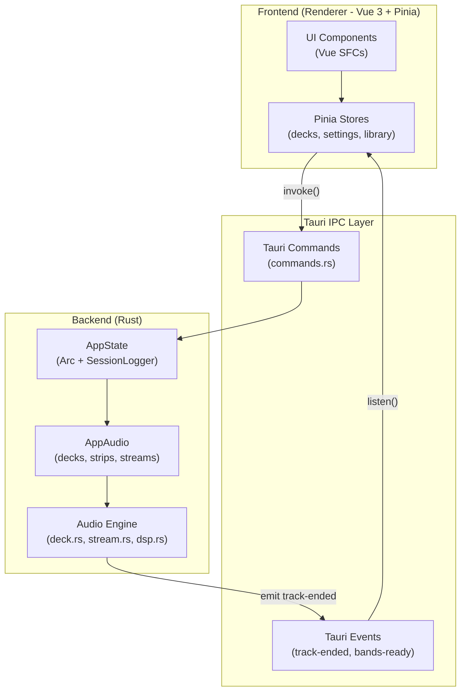
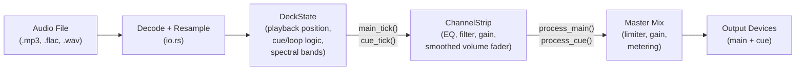
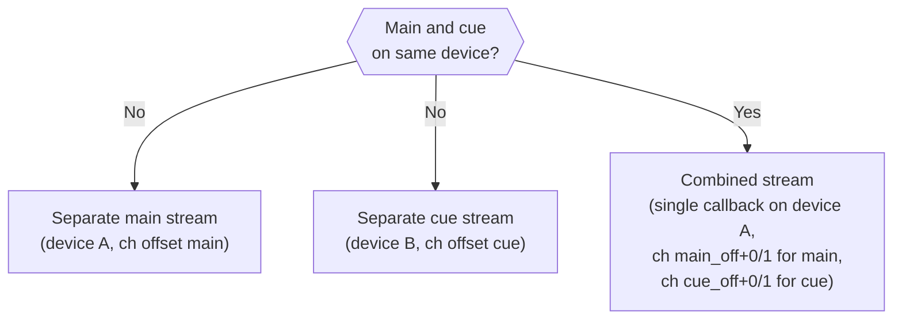
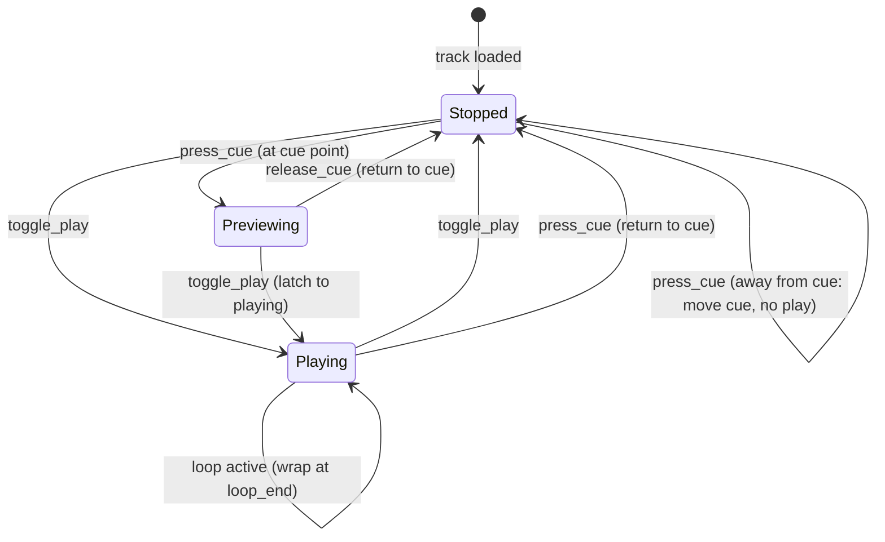
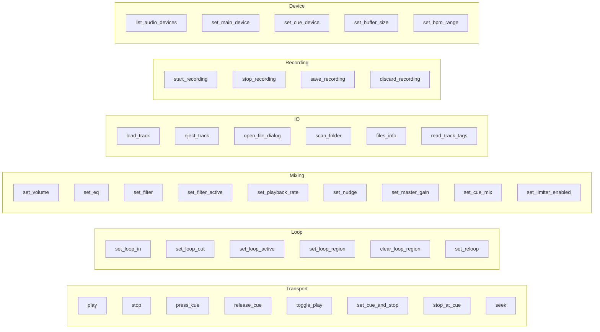

# Architecture

## Overall structure

```mermaid
graph TD
    subgraph Frontend ["Frontend (Renderer - Vue 3 + Pinia)"]
        UI["UI Components\n(Vue SFCs)"]
        Stores["Pinia Stores\n(decks, settings, library)"]
        UI --> Stores
    end

    subgraph IPC ["Tauri IPC Layer"]
        Commands["Tauri Commands\n(commands.rs)"]
        Events["Tauri Events\n(track-ended, bands-ready)"]
    end

    subgraph Backend ["Backend (Rust)"]
        AppState["AppState\n(Arc<AppAudio> + SessionLogger)"]
        Audio["AppAudio\n(decks, strips, streams)"]
        Engine["Audio Engine\n(deck.rs, stream.rs, dsp.rs)"]
    end

    Stores -- "invoke()" --> Commands
    Events -- "listen()" --> Stores
    Commands --> AppState
    AppState --> Audio
    Audio --> Engine
    Engine -- "emit track-ended" --> Events
```

## Audio signal chain (per deck)

```mermaid
graph LR
    File["Audio File\n(.mp3, .flac, .wav)"]
    Decode["Decode + Resample\n(io.rs)"]
    DeckState["DeckState\n(playback position,\ncue/loop logic,\nspectral bands)"]
    ChannelStrip["ChannelStrip\n(EQ, filter, gain,\nsmoothed volume fader)"]
    MasterMix["Master Mix\n(limiter, gain,\nmetering)"]
    Outputs["Output Devices\n(main + cue)"]

    File --> Decode
    Decode --> DeckState
    DeckState -- "main_tick()\ncue_tick()" --> ChannelStrip
    ChannelStrip -- "process_main()\nprocess_cue()" --> MasterMix
    MasterMix --> Outputs
```

## Stream routing

```mermaid
flowchart TD
    Decision{{"Main and cue\non same device?"}}

    Decision -- "No" --> SepMain["Separate main stream\n(device A, ch offset main)"]
    Decision -- "No" --> SepCue["Separate cue stream\n(device B, ch offset cue)"]
    Decision -- "Yes" --> Combined["Combined stream\n(single callback on device A,\nch main_off+0/1 for main,\nch cue_off+0/1 for cue)"]
```

## CUE state machine

```mermaid
stateDiagram-v2
    [*] --> Stopped : track loaded

    Stopped --> Previewing : press_cue (at cue point)
    Stopped --> Stopped : press_cue (away from cue: move cue, no play)
    Stopped --> Playing : toggle_play

    Previewing --> Stopped : release_cue (return to cue)
    Previewing --> Playing : toggle_play (latch to playing)

    Playing --> Stopped : toggle_play
    Playing --> Stopped : press_cue (return to cue)
    Playing --> Playing : loop active (wrap at loop_end)
```

## Tauri command categories

```mermaid
graph LR
    subgraph Transport
        play
        stop
        press_cue
        release_cue
        toggle_play
        set_cue_and_stop
        stop_at_cue
        seek
    end

    subgraph Loop
        set_loop_in
        set_loop_out
        set_loop_active
        set_loop_region
        clear_loop_region
        set_reloop
    end

    subgraph Mixing
        set_volume
        set_eq
        set_filter
        set_filter_active
        set_playback_rate
        set_nudge
        set_master_gain
        set_cue_mix
        set_limiter_enabled
    end

    subgraph IO
        load_track
        eject_track
        open_file_dialog
        scan_folder
        files_info
        read_track_tags
    end

    subgraph Recording
        start_recording
        stop_recording
        save_recording
        discard_recording
    end

    subgraph Device
        list_audio_devices
        set_main_device
        set_cue_device
        set_buffer_size
        set_bpm_range
    end
```
