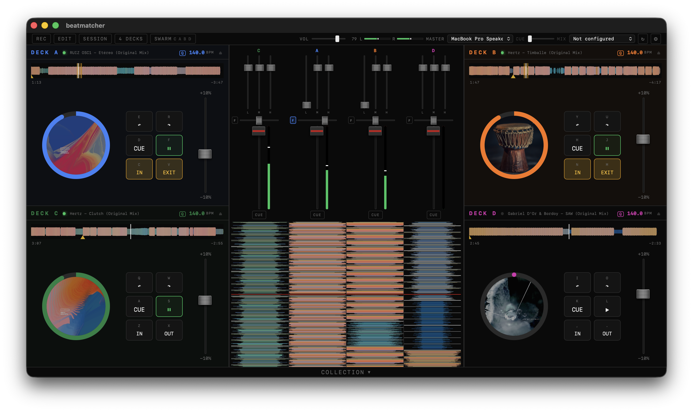

# Beatmatcher

A desktop app for practicing beat matching. Two or Four independent decks to play local audio.



## Download

Get the latest release for macOS, Windows or Linux (experimental) from the [Releases](https://github.com/berrutti/beatmatcher/releases) page.

### macOS note

The app is not code-signed, so macOS will block it on first launch. To fix this, after you drag and dropped the app to `Applications`, run once in Terminal:

```bash
xattr -cr /Applications/Beatmatcher.app
```

Then the app should open without problems.

---

## Safety warning

Beatmatcher is software in active development and can fail in unexpected ways: sudden volume spikes, full-scale noise, or other glitches are possible. I test it carefully and use it myself regularly, but I can't guarantee it won't fail. Do not connect it to expensive speakers, amplifiers, or other equipment without a limiter or other protection in between.

---

## Getting started

Import audio files into your collection. You can load those tracks into one of the four decks, and from there you can play, equalize and mix them.

The BPM will be auto-detected. If auto-detection fails, you can manually set the BPM in the "Edit" view.  
Having the correct BPM of each track is essential for proper mixing.

Each deck has EQ, a filter, looping and CUE routing, so you can practice full mixes, not just beatmatching in isolation.

## Edit mode

Switch to the "Edit" view (from the mode dropdown in the top bar) to fine-tune a track before you mix it: set or correct the BPM, adjust the beat grid, and set the cue point.

## Session mode

Record your mixes as you play. A session captures everything you do on the decks and mixer, and can be played back, edited on a timeline, and rendered down to a WAV or FLAC file.

## How to play

Beatmatcher was designed to be fully operable with pointer (trackpad, mouse) and keyboard.
You can press the following buttons to control the decks.

| Deck C | Deck A | Deck B | Deck D | Function   |
| ------ | ------ | ------ | ------ | ---------- |
| Q / W  | E / R  | Y / U  | I / O  | - Nudge +  |
| A / S  | D / F  | H / J  | K / L  | CUE / Play |
| Z / X  | C / V  | N / M  | , / .  | LOOP       |

## Development

```bash
yarn install
yarn dev
```

Built with Tauri + Vue 3 + TypeScript + Vite. See [architecture.md](architecture.md) for diagrams of the audio engine, signal chain, and IPC layer.

## Acknowledgements

The BPM detection logic was inspired by this [Joe Sullivan](https://x.com/itsjoesullivan)'s blog post:  
http://joesul.li/van/beat-detection-using-web-audio/  
The waveform and meter rendering were inspired by [Mixxx](https://github.com/mixxxdj/mixxx).

## License

Beatmatcher - A desktop app for practicing beat matching.  
Copyright (C) 2026 Matias Berrutti

This program is free software: you can redistribute it and/or modify it under the terms of the GNU General Public License as published by the Free Software Foundation, either version 3 of the License, or (at your option) any later version.

See the [LICENSE](LICENSE) file for the full terms.
