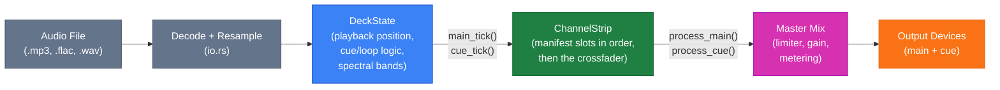
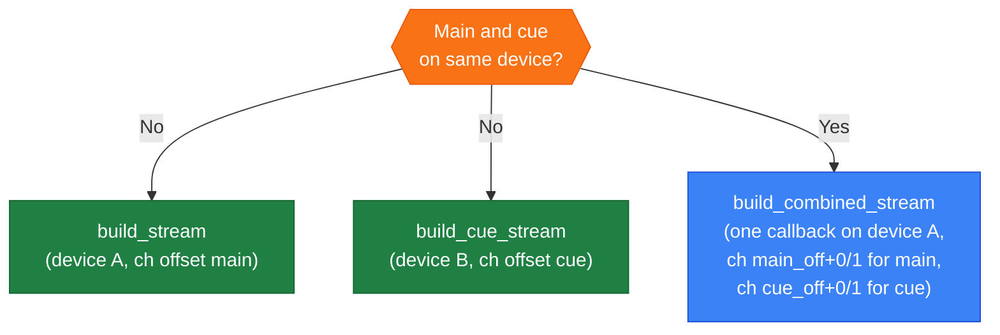
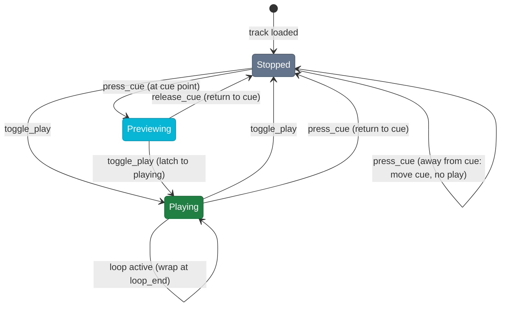
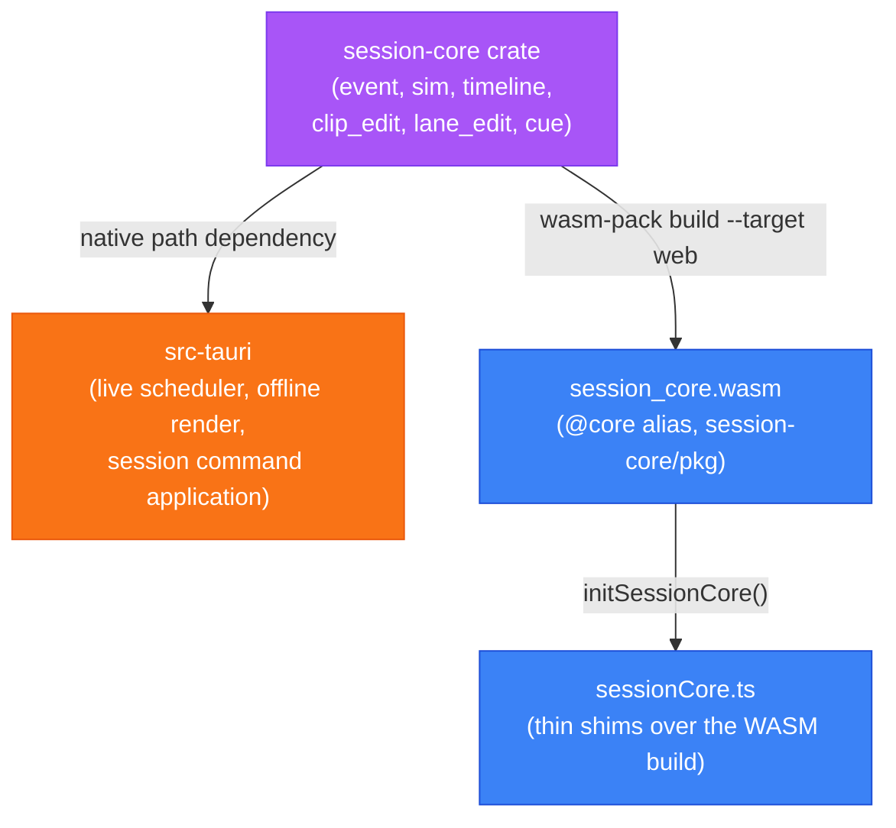

# Architecture

## Overall structure

## Audio signal chain (per deck)

`DeckState::render_block` is the single entry point the stream callbacks use to fill a buffer. Main and cue outputs are independently optional, so both routings below share one mixing loop.

## Mixer manifest

A `ChannelStrip` is not a fixed chain. `session_core::MixerManifest` describes it as an ordered list of slots, each naming a unit id that `audio/unit.rs` builds into an `AudioUnit`, plus a `cue_tap` slot and the master slots. `MIXER` in `audio/mod.rs` is the one manifest the live engine builds; the offline renderer builds whichever the `.bms` header names.

- **A slot is a position, not a unit.** `eq` is the second stage of the strip whatever fills it, so `classic-3band` and `isolator-3band` share addresses while reading their values in different ranges.
- **Every param carries its own range**, so nothing outside the manifest restates a min, max, step or default. `from_unit_interval` places a MIDI control on it and `clamp` bounds a `.bms` value.
- **`process_cue` taps before the `cue_tap` slot**, so the headphone feed is everything up to that point. The crossfader is applied after it, which is why a deck faded away is still audible in headphones.
- **`content_hash` covers everything that changes what a `set_param` means.** `resolve_manifest` refuses a session whose mixer this build does not have or has since changed, and the shipped hashes are pinned by test because a `.bms` on disk carries them.

## Engine to UI

Writes reach the UI on one channel. `engine_push.rs` collects dirty addresses and flushes them every 16 ms, reading each value at flush rather than capturing it at write time, so a push never carries a value a later write replaced.

`ParamOrigin` decides what travels: a `Ui` write is dropped, because sending the UI its own value back invites the control under the pointer to jump to a position it has already left. Only `Midi` writes are pushed. Repeated writes to one address collapse, which is what bounds a controller sweep to one message per flush instead of one per tick.

## Stream routing

## CUE state machine

## Shared session-core crate (Rust + WASM)

The session event model, replay simulation, timeline (clips/lanes), edit operations (clip move/trim/delete, lane automation, filter-region and nudge range edits), and CUE-sheet track-point derivation live in `session-core`, a Rust crate shared by the native engine and the frontend. It is built twice from the same source: as a native path-dependency of `src-tauri`, and via `wasm-pack build --target web` into `session-core/pkg` (gitignored, built by `yarn build:wasm`), loaded by the frontend through the `@core` alias. This keeps TypeScript from reimplementing the same simulation/edit logic as the Rust engine, where the two could silently drift out of sync.

`session_apply.rs::apply_deck_command` is the single implementation of `SessionCommand` application against the real `DeckState`/`ChannelStrip`, used by both the live scheduler and the offline renderer (parameterized over sample loading and live-only start-latency compensation). `session-core`'s own `DeckSim`/`StripSim` (used for scrub simulation and by the WASM build) remain a separate, audio-free implementation of the same command semantics, since the crate has no audio buffer types.

## Performer state broadcast

`src-tauri/src/broadcast.rs` publishes each live deck's beat state (bpm, beat offset, position, rate, nudge, `current_beat`) every 50 ms for an external app to phase-sync to: an atomically-replaced `state.json` in the app data dir on all platforms, plus a Unix domain socket (`beatmatcher.sock`, newline-delimited JSON) on unix. Best-effort: a slow socket reader drops frames, not the connection, and a sink setup failure disables broadcasting instead of aborting startup. The beat math is `session_core::current_beat`, the same function the phase ring uses via WASM.

## MIDI control

`src-tauri/src/midi.rs` owns the MIDI connection on its own thread and reaches the rest of the app through a single dispatch closure installed with `set_dispatch`. Nothing else crosses that boundary, so mapped input cannot reach device or buffer configuration, which rebuild the streams and stay on the main thread.

A **mapping** is a JSON file in `src-tauri/mappings/`, listing bindings that each pair a **source** with an **action**:

- A source is a control change or a note. Its resolution says how to read the value: `7bit`, `14bit` (low half on the controller 32 above the high one), `centre_delta` (signed speed either side of 64, what a jog platter reports), or `signed_step` (1 or 127 per detent, what a browse encoder reports).
- An action is one entry in a closed enum: a mixer parameter addressed as deck/slot/param, the crossfader, a transport button, the tempo fader, the jog, or browse.

`channel` counts from 1, the way the hardware's documentation and the console monitor do. The wire counts from 0 and the loader subtracts.

`match` claims a device by port-name substring. `decks` is `fixed` when the surface names its own decks and `assigned` when the user picks one deck for the whole device.

Most surfaces lay the same controls out per deck, one MIDI channel each. `per_deck` maps each deck to its channel and `deck_bindings` are written once and expanded across it, so neither the deck nor the channel is retyped per copy. That matters because a mistyped deck letter is a _valid_ address on another deck, which the collision check cannot see and which reads as the wrong deck's control moving. Anything that does not fit the pattern stays in `bindings` with its channel and deck written out.

A positional control is placed on its parameter's range by the mixer manifest (`ParamDescriptor::from_unit_interval`), so a binding carries no range of its own. A mapping whose bindings collide on one key is refused, because a silent collision moves the wrong deck's control and reads as broken hardware.

### Contributing a mapping

Bind against the device rather than its documentation. Dev builds log every incoming message to the browser console as raw bytes plus a decode, so connecting a controller in Settings and moving one control at a time is how addresses are found.

Encoders are the trap. Read one through a **full revolution** before deciding what it reports, because an absolute angle, a signed step and a speed are indistinguishable over a small nudge.

A control no action covers needs a new enum variant, and adding one fails to compile until every interpreter handles it. The vocabulary a mapping file can address should grow deliberately.

`version` is bumped when the file shape gains something an older build cannot see. A file declaring a newer version is refused, and so is one that uses the deck template while declaring a version that predates it, because the older build would find no bindings and present a dead controller rather than an error.

## Further reading

- [App modes and transitions](docs/app-modes.md)
- [Session playback and editing](docs/session-playback.md)
- [.bms file format](docs/bms-format.md)
