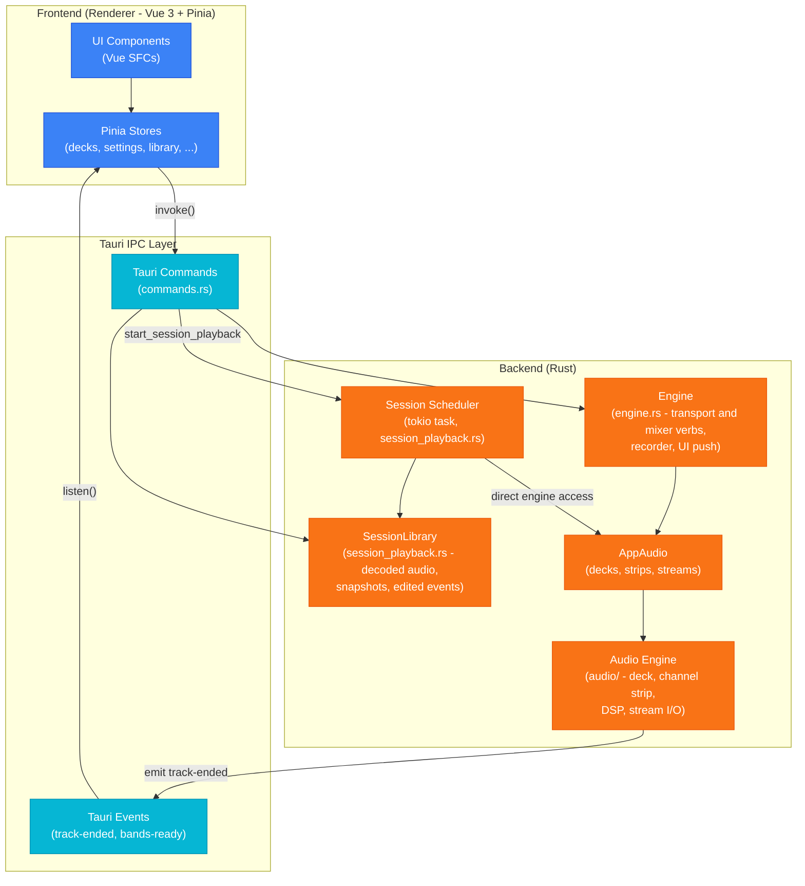
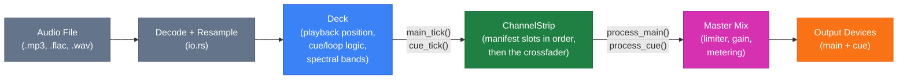
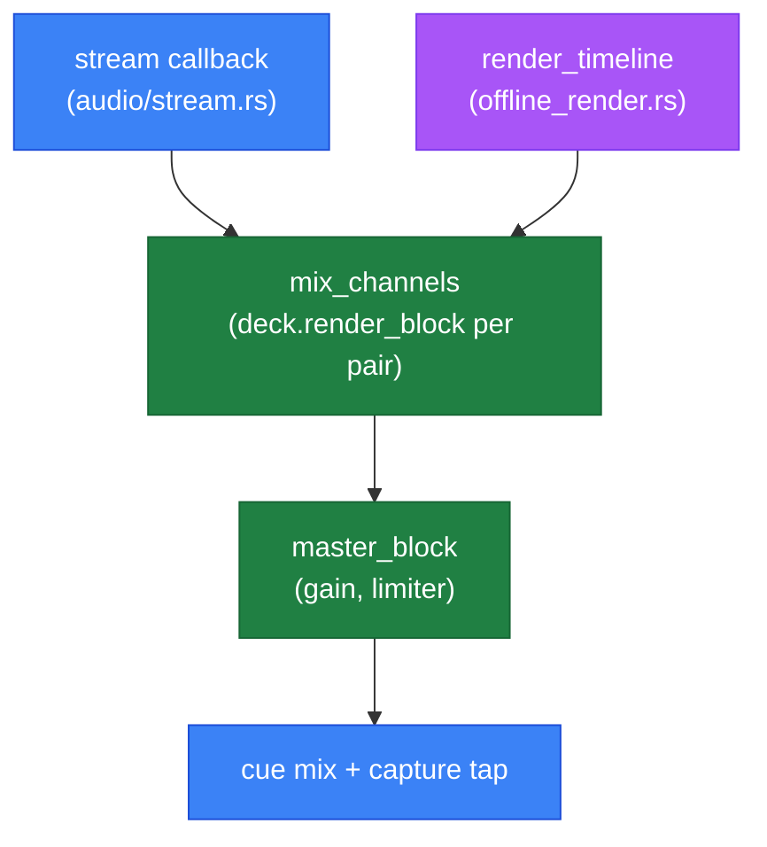
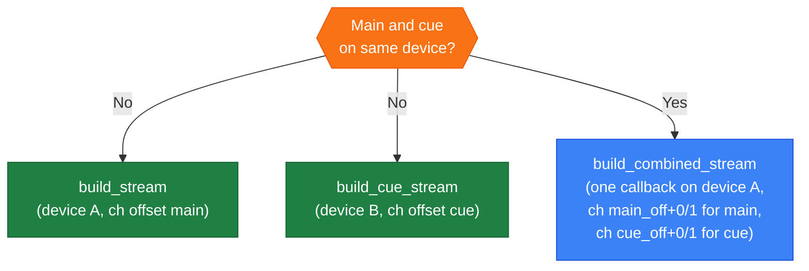
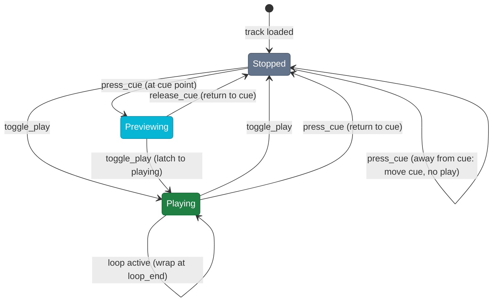
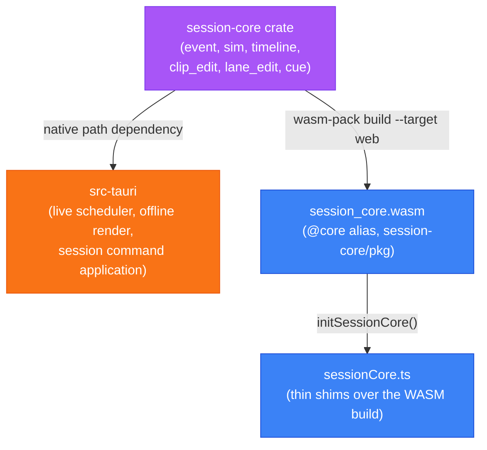

# Architecture

## Overall structure

Tauri manages three states independently, so a command receives only what it needs: `Engine` for
anything that moves a deck or the mixer, `SessionLibrary` for a loaded `.bms`, and `SurfaceControl`
for whether a control surface may drive the decks. `Engine` carries the audio handle, the session
recorder and the UI push together, because every write to the mixer also records itself and mirrors
back to the surface that did not move.

Every `#[tauri::command]` lives in `commands.rs`. Where the work belongs to another module the
command is a wrapper that calls into it, so `session_playback` and `midi` keep their internals
private.

## Audio signal chain (per deck)

`Deck::render_block` is the single entry point the stream callbacks use to fill a buffer. Main and cue outputs are independently optional, so both routings below share one mixing loop.

## One block, two callers

A block of audio is produced in one place, whether it is heard now or rendered from a `.bms` later. `mix_channels` walks the same `(Deck, ChannelStrip)` pairs and `master_block` applies gain and the limiter over the result. The live callback adds the cue mix and the recording tap. The offline render adds neither.

The offline render works through the timeline in chunks of the buffer size the `.bms` recorded, because anything consumed once per callback rather than once per frame reads differently at another length.

## Mixer manifest

A `ChannelStrip` is not a fixed chain. `session_core::MixerManifest` describes it as an ordered list of slots, each naming a unit id that `audio/unit.rs` builds into an `AudioUnit`, plus a `cue_tap` slot and the master slots. `MIXER` in `audio/mod.rs` is the one manifest the live engine builds. The offline renderer builds whichever the `.bms` header names.

- **A slot is a position, not a unit.** `eq` is the second stage of the strip whatever fills it, so `classic-3band` and `isolator-3band` share addresses while reading their values in different ranges.
- **Every param carries its own range**, so nothing outside the manifest restates a min, max, step or default. `from_unit_interval` places a MIDI control on it and `clamp` bounds a `.bms` value.
- **`process_cue` taps before the `cue_tap` slot**, so the headphone feed is everything up to that point. The crossfader is applied after it, which is why a deck faded away is still audible in headphones.
- **`content_hash` covers everything that changes what a `set_param` means.** `resolve_manifest` refuses a session whose mixer this build does not have or has since changed, and the shipped hashes are pinned by test because a `.bms` on disk carries them.

## Engine to UI

Turn a knob on the controller and the on-screen knob has to move with it. `engine_push.rs` does that, and it has to survive a physical fader sweep, which can produce hundreds of MIDI messages a second.

It never queues values. Each change records only _which_ control moved: deck A's EQ low, the crossfader, deck B's transport. A background thread wakes every 16 ms, reads the current value of each control that moved, and emits one batch (`engine-params`, `engine-transport`, `engine-rate`, `engine-assign`).

Two consequences fall out of storing addresses instead of values:

- **A sweep costs one message per flush, not one per MIDI tick.** Three hundred writes to the same fader in one window are one entry in the set.
- **A push can never carry a stale value.** The value is read at flush time, so it is whatever the engine holds right then, not whatever it held when the write happened.

`ParamOrigin` decides what gets recorded at all. A `Ui` write is skipped: the UI made that change and already shows it, so echoing it back would drag the control out from under the user's pointer mid-drag. Only `Midi` writes are pushed.

## Stream routing

## CUE state machine

## Shared session-core crate (Rust + WASM)

The session event model, replay simulation, timeline (clips/lanes), edit operations (clip move/trim/delete, lane automation, filter-region and nudge range edits), and CUE-sheet track-point derivation live in `session-core`, a Rust crate shared by the native engine and the frontend. It is built twice from the same source: as a native path-dependency of `src-tauri`, and via `wasm-pack build --target web` into `session-core/pkg` (gitignored, built by `yarn build:wasm`), loaded by the frontend through the `@core` alias. This keeps TypeScript from reimplementing the same simulation/edit logic as the Rust engine, where the two could silently drift out of sync.

`session_apply.rs::apply_deck_command` is the single implementation of `SessionCommand` application against the real `Deck`/`ChannelStrip`, used by both the live scheduler and the offline renderer (parameterized over sample loading and live-only start-latency compensation). `session-core`'s own `DeckSim`/`StripSim` (used for scrub simulation and by the WASM build) remain a separate, audio-free implementation of the same command semantics, since the crate has no audio buffer types.

## Session timeline rendering

The timeline is retained-mode over a plain 2D canvas. The scene is a flat list of `SceneItem`s (`utils/timelineEngine.ts`). An item knows its own bounds, draws itself clipped to them, and hit-tests itself. No item holds gesture state.

Two orderings run over that list, and they are deliberately not the same one:

- **Draw order** is list order. The scene builder composes it, earlier items paint under later ones.
- **Hit precedence** is a separate table in `utils/timelineHits.ts`, keyed by `target:part` so a clip's trim edge can outrank a nudge while its body does not. When several items claim a point, the highest-ranked claimer wins, ties broken by draw order.

`composables/useTimelineGestures.ts` is the interaction layer. On pointer-down it hit-tests the scene, picks a gesture from the hit plus modifiers, and drives the drag, emitting semantic intents that the controller reacts to. Gesture visuals in progress (the draw line, a clip ghost, nudge and filter previews) are pushed back as overlay `SceneItem`s, so the renderer draws them like anything else.

## Collection column widths

A resizable column holds a unitless share, never a pixel width. Its rendered width is its share over the sum of the visible resizable shares, so those columns fill whatever space they are given by construction. A drag trades share between two adjacent columns and leaves every other column's share untouched. `bpm` and `added` sit outside the system at fixed pixel widths, their content never needing an adjustable one.

`table-layout: fixed` updates a `<col>`'s width attribute from a `calc()` but does not re-lay-out the table, so shares are resolved to pixels in JS rather than handed to the browser as an expression.

## Performer state broadcast

`src-tauri/src/broadcast.rs` publishes each live deck's beat state (bpm, beat offset, position, rate, nudge, `current_beat`) every 50 ms for an external app to phase-sync to: an atomically-replaced `state.json` in the app data dir on all platforms, plus a Unix domain socket (`beatmatcher.sock`, newline-delimited JSON) on unix. Best-effort: a slow socket reader drops frames, not the connection, and a sink setup failure disables broadcasting instead of aborting startup. The beat math is `session_core::current_beat`, the same function the phase ring uses via WASM.

## MIDI control

`src-tauri/src/midi/` owns the MIDI connection on its own thread and reaches the rest of the app through a single dispatch closure installed with `set_dispatch`. Nothing else crosses that boundary, so mapped input cannot reach device or buffer configuration, which rebuild the streams and stay on the main thread.

Decoding a message and reading a mapping file are separate modules, each importing only the addressing vocabulary it uses. That vocabulary, the byte constants and `Source`/`Key`/`Resolution`/`Half`, is its own module because both need it. The connection, the device registry and dispatch into the engine stay in `mod.rs`.

A **mapping** is a JSON file in `src-tauri/mappings/`, listing bindings that each pair a **source** with an **action**:

- A source is a control change or a note. Its resolution says how to read the value: `7bit`, `14bit` (low half on the controller 32 above the high one), `centre_delta` (signed speed either side of 64, what a jog platter reports), or `signed_step` (1 or 127 per detent, what a browse encoder reports).
- An action is one entry in a closed enum: a mixer parameter addressed as deck/slot/param, the crossfader, a transport button, the tempo fader, the jog, or browse.

`channel` counts from 1, the way the hardware's documentation and the console monitor do. The wire counts from 0 and the loader subtracts.

`match` claims a device by port-name substring. `decks` is `fixed` when the surface names its own decks and `assigned` when the user picks one deck for the whole device.

Most surfaces lay the same controls out per deck, one MIDI channel each. `per_deck` maps each deck to its channel and `deck_bindings` are written once and expanded across it, so neither the deck nor the channel is retyped per copy. That matters because a mistyped deck letter is a _valid_ address on another deck, which the collision check cannot see and which reads as the wrong deck's control moving. Anything that does not fit the pattern stays in `bindings` with its channel and deck written out.

A positional control is placed on its parameter's range by the mixer manifest (`ParamDescriptor::from_unit_interval`), so a binding carries no range of its own. A mapping whose bindings collide on one key is refused, because a silent collision moves the wrong deck's control and reads as broken hardware.

### Contributing a mapping

Bind against the device rather than its documentation. Dev builds log every incoming message to the browser console as raw bytes plus a decode, so connecting a controller in Settings and moving one control at a time is how addresses are found.

Encoders are the trap. Read one through a **full revolution** before deciding what it reports, because an absolute angle, a signed step and a speed are indistinguishable over a small nudge.

A control no action covers needs a new enum variant, and adding one fails to compile until every interpreter handles it. The vocabulary a mapping file can address should grow deliberately.

`version` is bumped when the file shape gains something an older build cannot see. A file declaring a newer version is refused, and so is one that uses the deck template while declaring a version that predates it, because the older build would find no bindings and present a dead controller rather than an error.

## Further reading

- [App modes and transitions](docs/app-modes.md)
- [Session playback and editing](docs/session-playback.md)
- [.bms file format](docs/bms-format.md)
