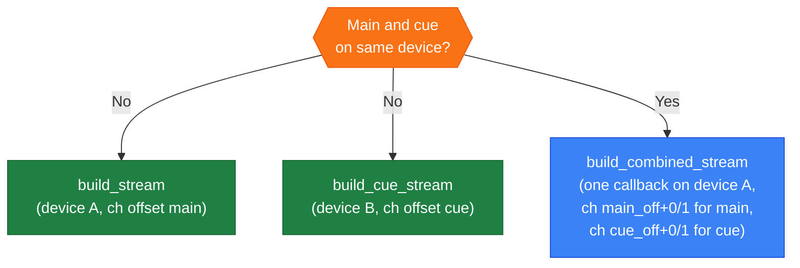
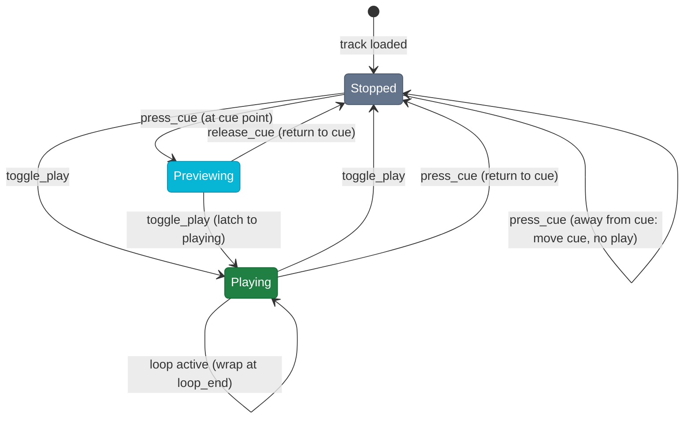
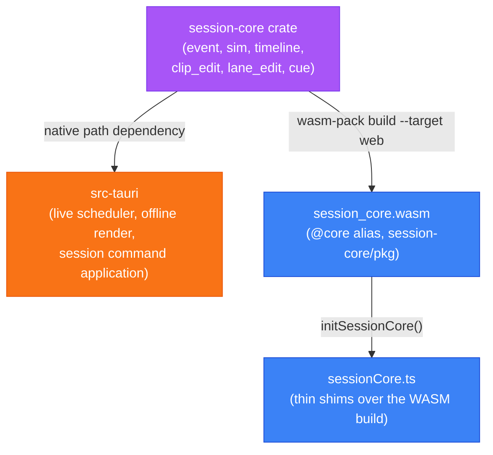

# Architecture

## Overall structure

## Audio signal chain (per deck)

```mermaid
graph LR
    classDef io fill:#64748b,stroke:#475569,color:#fff
    classDef deck fill:#3b82f6,stroke:#1d4ed8,color:#fff
    classDef strip fill:#208043,stroke:#166534,color:#fff
    classDef master fill:#d631b0,stroke:#a21caf,color:#fff
    classDef out fill:#f97316,stroke:#ea580c,color:#fff

    File["Audio File\n(.mp3, .flac, .wav)"]:::io
    Decode["Decode + Resample\n(io.rs)"]:::io
    DeckState["DeckState\n(playback position,\ncue/loop logic,\nspectral bands)"]:::deck
    ChannelStrip["ChannelStrip\n(EQ, filter, gain,\nsmoothed volume fader)"]:::strip
    MasterMix["Master Mix\n(limiter, gain,\nmetering)"]:::master
    Outputs["Output Devices\n(main + cue)"]:::out

    File --> Decode
    Decode --> DeckState
    DeckState -- "main_tick()\ncue_tick()" --> ChannelStrip
    ChannelStrip -- "process_main()\nprocess_cue()" --> MasterMix
    MasterMix --> Outputs
```

`DeckState::render_block` is the single entry point the stream callbacks use to fill a buffer. It takes the main and cue outputs as independently optional, so both stream routings below share one renderer rather than each carrying its own copy of the mixing loop.

## Stream routing

## CUE state machine

## Shared session-core crate (Rust + WASM)

The session event model, replay simulation, timeline (clips/lanes), edit operations (clip move/trim/delete, lane automation, filter-region and nudge range edits), and CUE-sheet track-point derivation live in `session-core`, a Rust crate shared by the native engine and the frontend. It is built twice from the same source: as a native path-dependency of `src-tauri`, and via `wasm-pack build --target web` into `session-core/pkg` (gitignored, built by `yarn build:wasm`), loaded by the frontend through the `@core` alias. This keeps TypeScript from reimplementing the same simulation/edit logic as the Rust engine, where the two could silently drift out of sync.

`session_apply.rs::apply_deck_command` is the single implementation of `SessionCommand` application against the real `DeckState`/`ChannelStrip`, used by both the live scheduler and the offline renderer (parameterized over sample loading and live-only start-latency compensation). `session-core`'s own `DeckSim`/`StripSim` (used for scrub simulation and by the WASM build) remain a separate, audio-free implementation of the same command semantics, since the crate has no audio buffer types.

## Performer state broadcast

`src-tauri/src/broadcast.rs` publishes each live deck's beat state (bpm, beat offset, position, rate, nudge, `current_beat`) every 50 ms for an external app to phase-sync to: an atomically-replaced `state.json` in the app data dir on all platforms, plus a Unix domain socket (`beatmatcher.sock`, newline-delimited JSON) on unix. Best-effort: a slow socket reader drops frames, not the connection, and a sink setup failure disables broadcasting instead of aborting startup. The beat math is `session_core::current_beat`, the same function the phase ring uses via WASM.

## MIDI control

`src-tauri/src/midi.rs` owns the MIDI connection on its own thread and reaches the rest of the app through a single dispatch closure installed with `set_dispatch`. Nothing else crosses that boundary, so mapped input cannot reach device or buffer configuration, which have to stay on the main thread because they rebuild the streams.

A **mapping** is a list of bindings, each pairing a **source** with an **action**:

- A source is a control change or a note, with a resolution that says how to read its value: `SevenBit`, `FourteenBit` (the low half arrives on the controller 32 above the high one), `CentreDelta` (a signed speed either side of 64, which is what a jog platter reports), or `SignedStep` (1 or 127 for one detent, which is what a browse encoder reports).
- An action is one entry in a closed enum: a mixer parameter addressed as deck/slot/param, the crossfader, a transport button, the tempo fader, the jog, or browse.

A positional control is placed on its parameter's own range by the mixer manifest (`ParamDescriptor::from_unit_interval`), so a binding never carries a range of its own and a mapping stays correct when a mixer changes shape. A mapping whose bindings collide on the same key is refused rather than letting the last one win, because the symptom of a silent collision is the wrong deck's control moving, which reads as broken hardware.

### Contributing a mapping

A mapping is a data file, one per device, so a controller nobody here owns can be supported by someone who owns it without compiling anything. Note ids, CC ids, encoder direction and resolution all differ per device and belong in the file.

The loader is not written yet, and the one device in hand is still a hardcoded profile pending a pass over it on real hardware. That profile is a placeholder, not a pattern: it gets migrated onto the format and deleted from Rust in the same change that adds the loader, with the existing MIDI tests re-pointed at the file. **Do not add a second Rust profile alongside it.** A format designed next to a hardcoded mapping that keeps working drifts from it immediately, because anything Rust can still special-case, it will, and the file ends up unable to express it.

What is useful before then is a capture. Bind against the device, not its documentation: every incoming message is logged to the browser console as raw bytes plus a decode, so connecting a controller in Settings and moving one control at a time is how the addresses are found. Encoders are the trap. Read one through a **full revolution** before deciding what it reports, because a value that walks under a slow nudge can be an absolute angle, a signed step or a speed, and the three are indistinguishable over a small movement while being obvious over a whole turn.

Actions are a closed enum, so a control that none of them covers will need a new variant, and adding one fails to compile until every place that interprets an action handles it. That is the intended friction: the vocabulary a mapping file can address is the thing being designed, and it should grow deliberately.

## Further reading

- [App modes and transitions](docs/app-modes.md)
- [Session playback and editing](docs/session-playback.md)
- [.bms file format](docs/bms-format.md)
