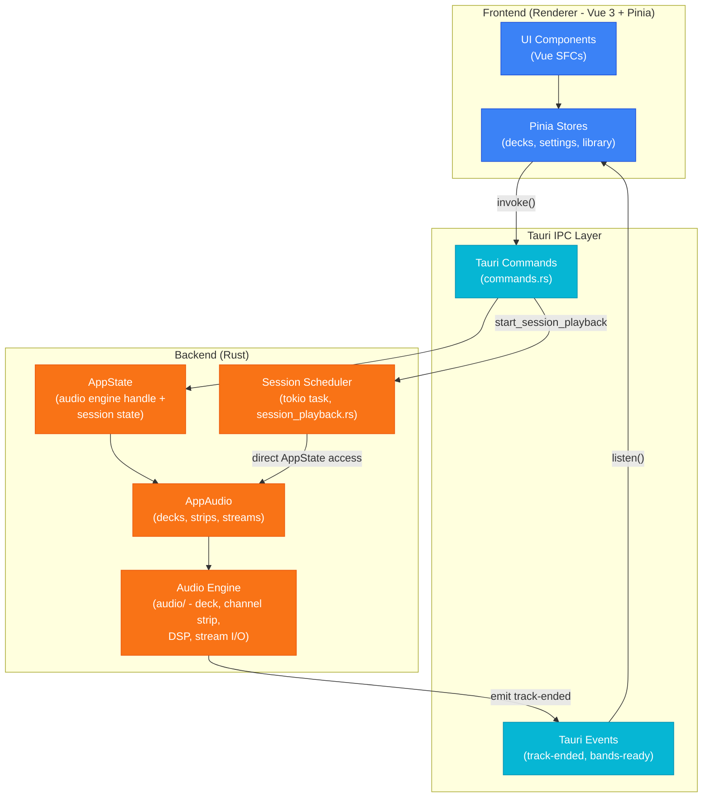
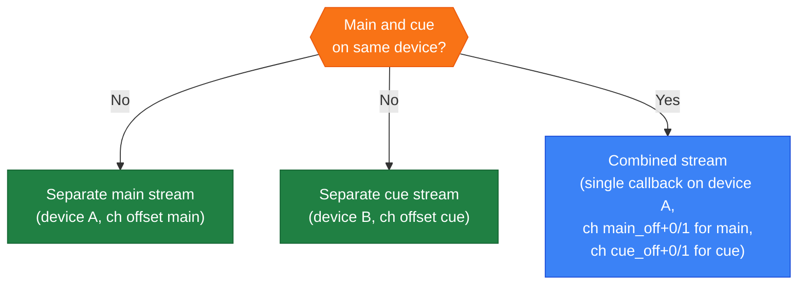
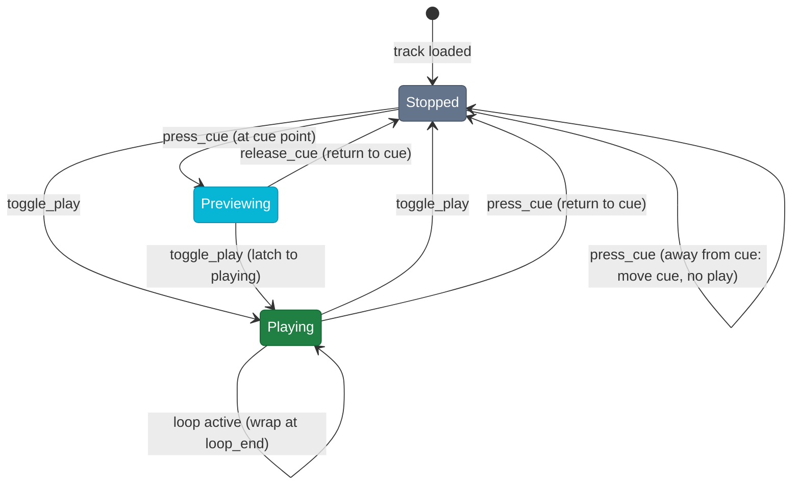
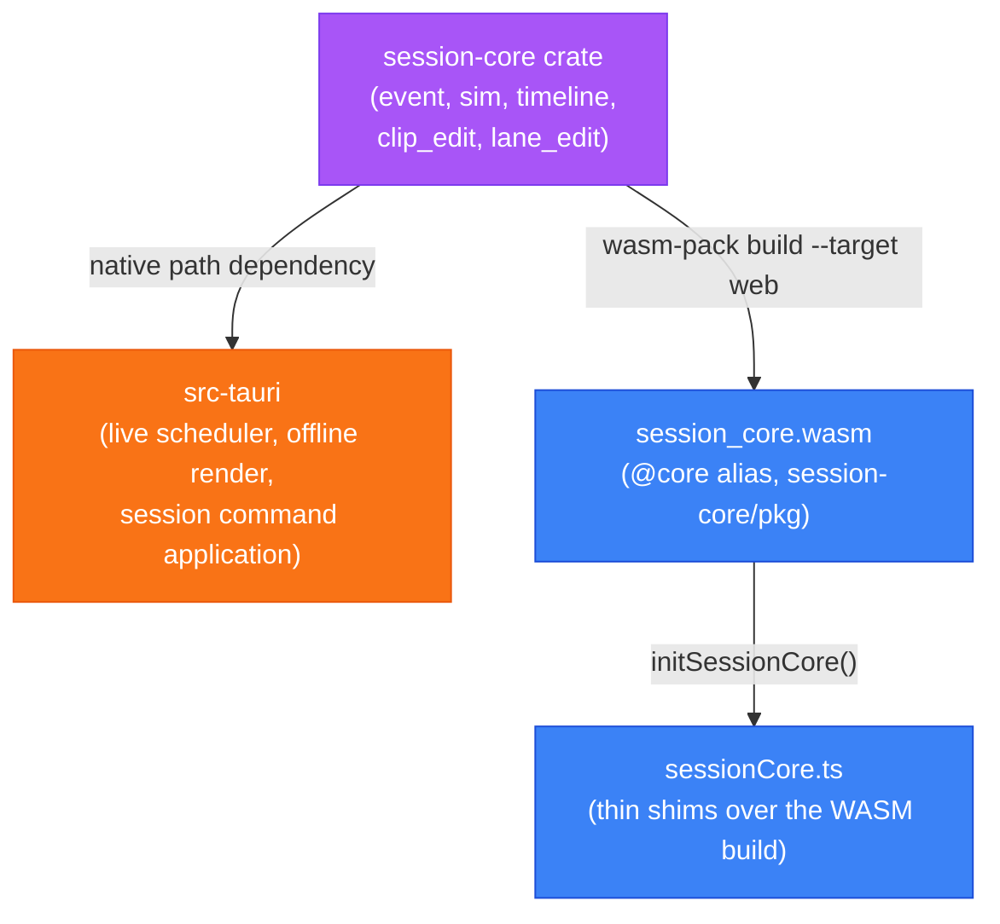

# Architecture

## Overall structure

## Audio signal chain (per deck)

```mermaid
graph LR
    classDef io fill:#64748b,stroke:#475569,color:#fff
    classDef deck fill:#3b82f6,stroke:#1d4ed8,color:#fff
    classDef strip fill:#208043,stroke:#166534,color:#fff
    classDef master fill:#d631b0,stroke:#a21caf,color:#fff
    classDef out fill:#f97316,stroke:#ea580c,color:#fff

    File["Audio File\n(.mp3, .flac, .wav)"]:::io
    Decode["Decode + Resample\n(io.rs)"]:::io
    DeckState["DeckState\n(playback position,\ncue/loop logic,\nspectral bands)"]:::deck
    ChannelStrip["ChannelStrip\n(EQ, filter, gain,\nsmoothed volume fader)"]:::strip
    MasterMix["Master Mix\n(limiter, gain,\nmetering)"]:::master
    Outputs["Output Devices\n(main + cue)"]:::out

    File --> Decode
    Decode --> DeckState
    DeckState -- "main_tick()\ncue_tick()" --> ChannelStrip
    ChannelStrip -- "process_main()\nprocess_cue()" --> MasterMix
    MasterMix --> Outputs
```

## Stream routing

## CUE state machine

## Shared session-core crate (Rust + WASM)

The session event model, replay simulation, timeline (clips/lanes), and edit operations (clip move/trim/delete, lane automation, filter-region and nudge range edits) live in `session-core`, a dependency-free Rust crate shared by the native engine and the frontend. It is built twice from the same source: as a native path-dependency of `src-tauri`, and via `wasm-pack build --target web` into `session-core/pkg` (gitignored, built by `yarn build:wasm`), loaded by the frontend through the `@core` alias. This removes the previous split where the frontend's TypeScript reimplemented the same simulation/edit logic as the Rust engine and could silently drift out of sync.

`session_apply.rs::apply_deck_command` is the single implementation of `SessionCommand` application against the real `DeckState`/`ChannelStrip`, used by both the live scheduler and the offline renderer (parameterized over sample loading and live-only start-latency compensation). `session-core`'s own `DeckSim`/`StripSim` (used for scrub simulation and by the WASM build) remain a separate, audio-free implementation of the same command semantics, since the crate has no audio buffer types.

## Further reading

- [App modes and transitions](docs/app-modes.md)
- [Session playback and editing](docs/session-playback.md)
- [.bms file format](docs/bms-format.md)
